## AWS IoT Core Setup

### Sign up for an AWS account

1. Open https://portal.aws.amazon.com/billing/signup.
2. Follow the online instructions. **NOTE:** Part of the sign-up procedure involves receiving a phone call and entering a verification code on the phone keypad. 
3. Make a note of your AWS account number as it will be needed for following steps.

### Create an Administrator IAM user and grant it permissions

It’s strongly recommended that you adhere to the best practice of using the `Administrator` IAM user that the following steps show you how to create and securely lock away the root user credentials. One should only sign in as the root user to perform a few [account and service management tasks](https://docs.aws.amazon.com/general/latest/gr/root-vs-iam.html#aws_tasks-that-require-root). 

1. Sign in to the [IAM console](https://console.aws.amazon.com/iam/) as the account owner by choosing **Root user** and entering your AWS account email address. On the next page, enter your password.
2. On the navigation bar, click your account name, and then click Account.

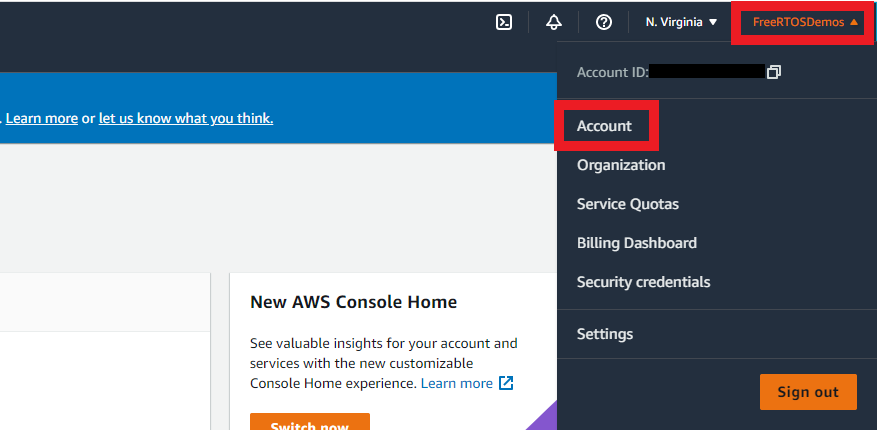

3. Scroll down to to **IAM User and Role Access to Billing Information** and click **Edit**.

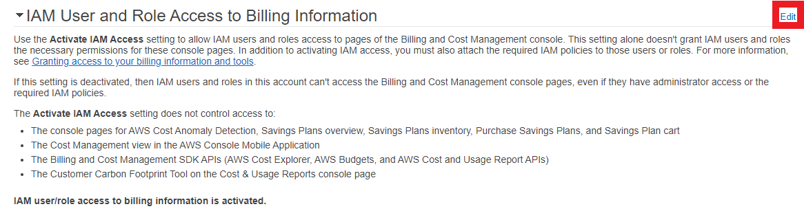

4. Select the **Activate IAM Access** check box to activate access to the Billing and Cost Management console pages. This is necessary to create an IAM role with AdministrativeAccess in the following steps.

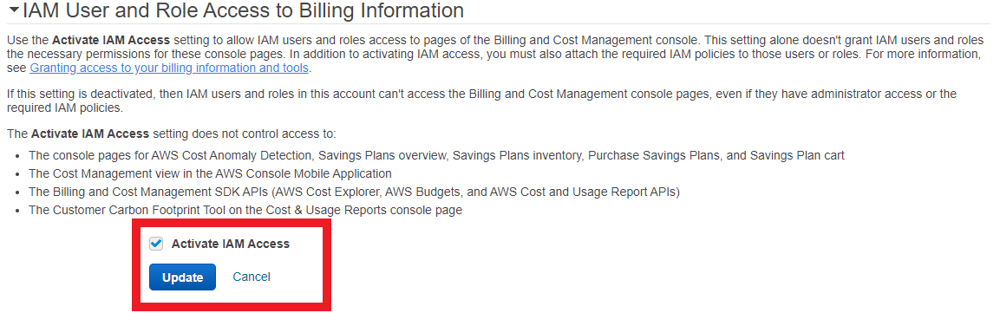

5. Click **Update**.
6. Return to the [IAM console](https://console.aws.amazon.com/iam/).
7. In the navigation pane, choose **Users** and then choose **Add user**.

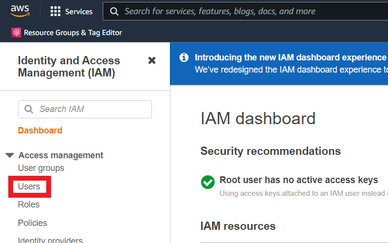
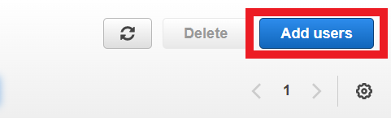

8. For **User name**, enter `Administrator`. Select the check box next to **AWS Management Console access**. Then select **Custom password**, and then enter your new password in the text box. 
9. (Optional) By default, AWS requires the new user to create a new password when first signing in. You can clear the check box next to **User must create a new password at next sign-in** to allow the new user to reset their password after they sign in.

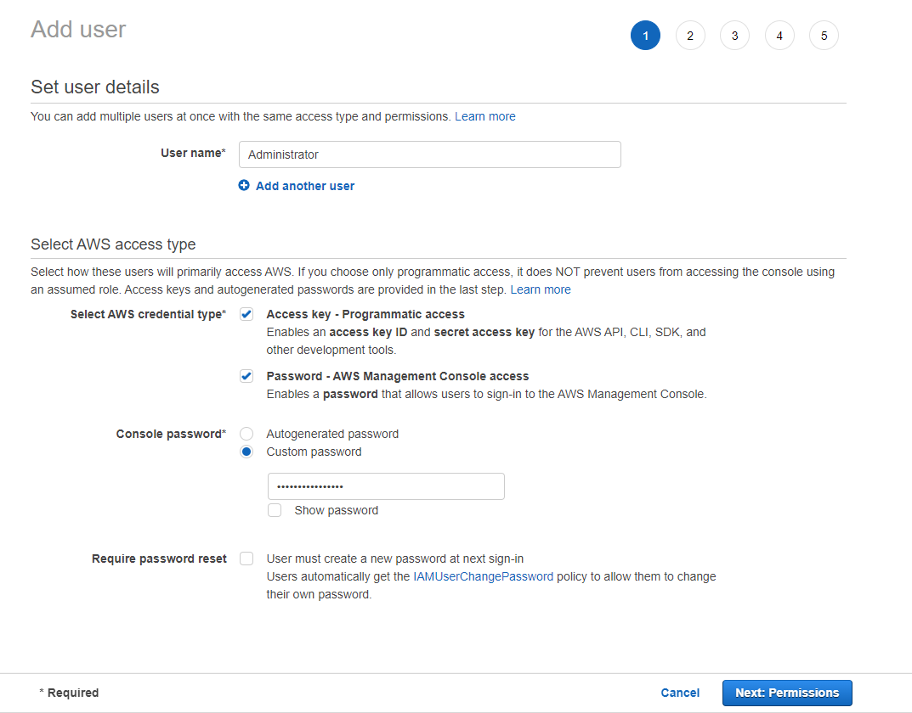

10. Click **Next: Permissions**.
11. Click **Create group**.

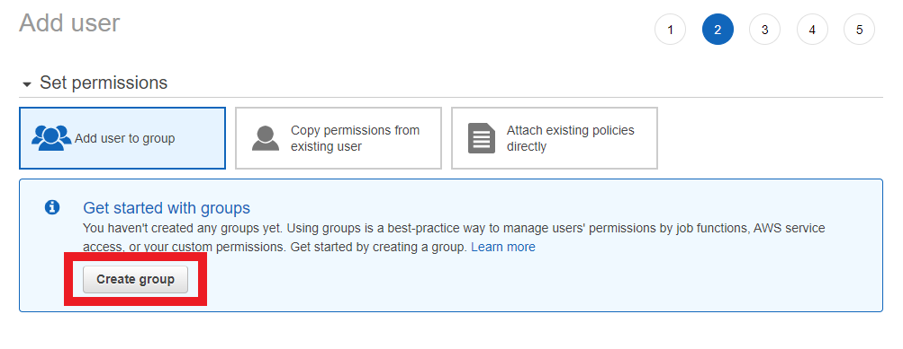

12. In the **Create group** dialog box, for **Group name** enter `Administrators`.
13. In the search box next to **Filter policies**, enter **Administrator Access.**
14. In the policy list, select the check box for **AdministratorAccess**. Then choose **Create group**.

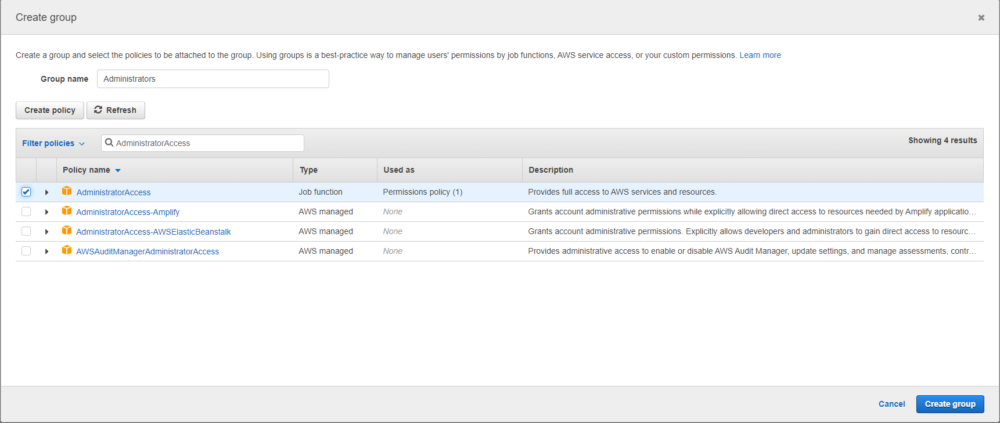

15. Back in the list of groups, select the check box for your new group. Choose **Refresh** if necessary to see the group in the list.

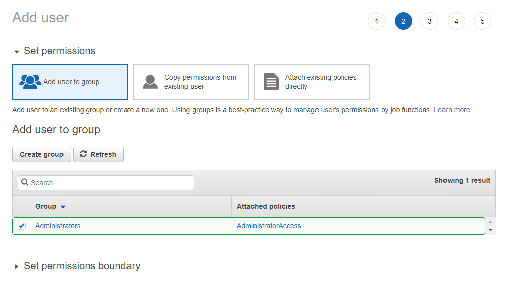

16. Click **Next: Tags**.
17. **(Optional)** Add metadata to the user by attaching tags as key-value pairs. For more information about using tags in IAM, see [Tagging IAM entities](https://docs.aws.amazon.com/IAM/latest/UserGuide/id_tags.html) in the *IAM User Guide*.
18. Click **Next: Review** to see the list of group memberships to be added to the new user. When you are ready to proceed, click **Create user**.

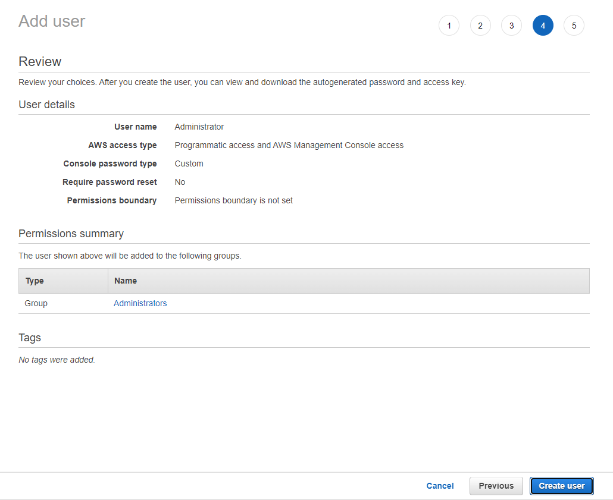

19. You should now see a page like the following, stating that your IAM user has been created. Click **Download .csv** in order to save your IAM credentials - store these in a safe place. These are necessary for signing into the AWS console with your newly created IAM user.

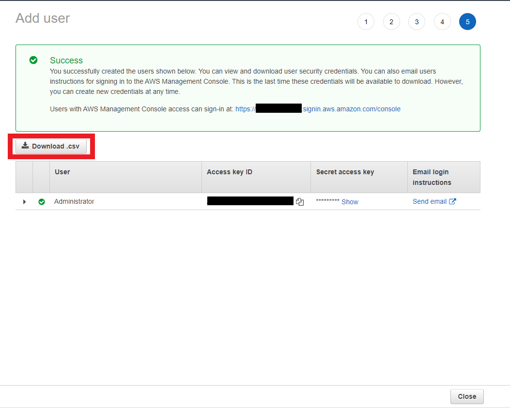

20. On the navigation bar, click your account name, and then click **Sign Out**.
21. Click **Sign In to the Console** or go to https://console.aws.amazon.com/.
22. Select **IAM user** and enter your Account ID noted earlier, then click **Next**.

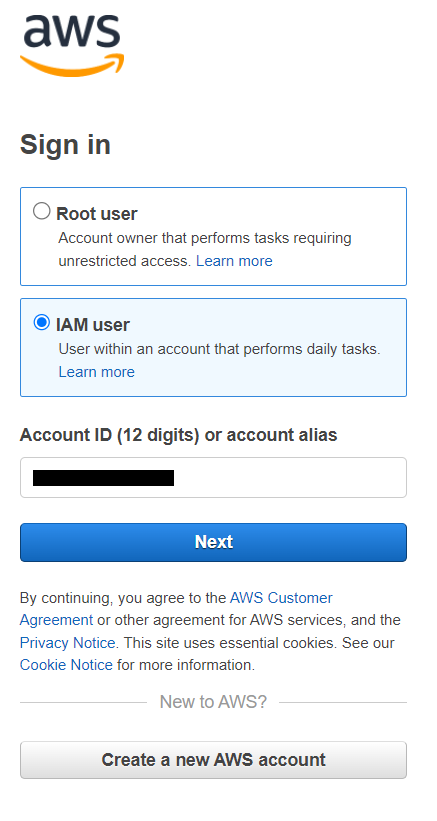

23. Enter **Administrator** in **IAM user name,** enter the **Password** set earlier for the IAM user, then click **Sign in**.

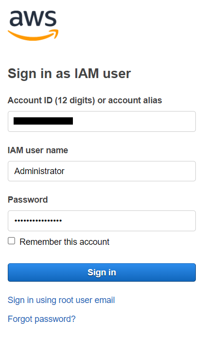

24. You are now signed in as your **Administrator** IAM user. This IAM user will be used for following steps.

### Registering your board with AWS IoT

Your board must be registered with AWS IoT to communicate with the AWS Cloud. To register your board with AWS IoT, you must have:

* **An AWS IoT policy:** An AWS IoT policy grants your device permissions to access AWS IoT resources. It is stored on the AWS Cloud.
* **An AWS IoT thing:** An AWS IoT thing allows you to manage your devices in AWS IoT. It is stored on the AWS Cloud.
* **A private key and X.509 certificate:** A private key and certificate allow your device to authenticate with AWS IoT.
* **An AWS endpoint:** An AWS endpoint is the endpoint your devices connect to.

#### Creating an AWS IoT policy

1. Go to the [AWS IoT console](https://console.aws.amazon.com/iotv2/).
2. In the navigation pane, click **Secure**, then click **Policies** in the drop-down menu.

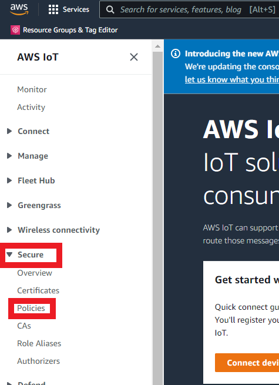

3. Click **Create Policy**.
4. Enter a name to identify the policy. For this example, the name **DevicePolicy** will be used.

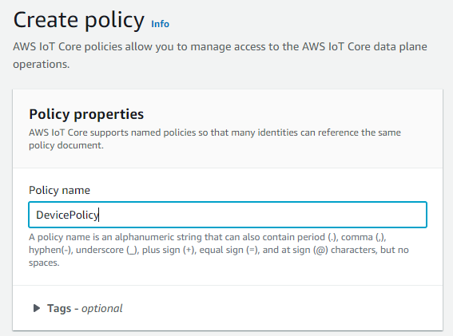

5. Identify your **AWS region** by clicking the location dropdown menu at the top of the page to the left of the account dropdown menu. The **AWS region** is the orange text on the right. For this example, the **AWS region** will be **us-west-2**.

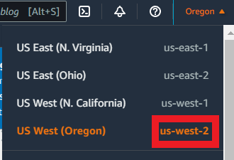

6. Scroll down to **Policy document** and click the **JSON** button.

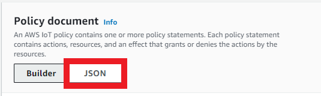

7. Inside the **Policy document**, copy and paste the following JSON into the policy editor window. Replace `aws-region` and `aws-account-id` with your AWS Region and Account ID.

```
{
    "Version": "2012-10-17",
    "Statement": [
    {
        "Effect": "Allow",
        "Action": "iot:Connect",
        "Resource":"arn:aws:iot:aws-region:aws-account-id:*"
    }, 
    {
        "Effect": "Allow",
        "Action": "iot:Publish",
        "Resource": "arn:aws:iot:aws-region:aws-account-id:*"
    },
    {
         "Effect": "Allow",
         "Action": "iot:Subscribe",
         "Resource": "arn:aws:iot:aws-region:aws-account-id:*"
    },
    {
         "Effect": "Allow",
         "Action": "iot:Receive",
         "Resource": "arn:aws:iot:aws-region:aws-account-id:*"
    }
    ]
}
```

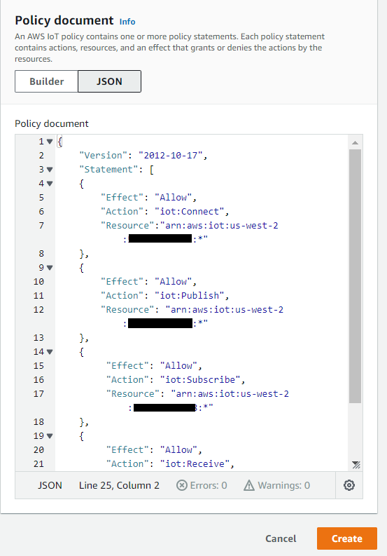

This policy grants the following permissions:

* **iot:Connect:** Grants your device the permission to connect to the AWS IoT message broker with any client ID.
* **iot:Publish:** Grants your device the permission to publish an MQTT message on any MQTT topic.
* **iot:Subscribe:** Grants your device the permission to subscribe to any MQTT topic filter.
* **iot:Receive:** Grants your device the permission to receive messages from the AWS IoT message broker on any MQTT topic.

For more information regarding [IAM policy creation](https://docs.aws.amazon.com/IAM/latest/UserGuide/access_policies_create.html) refer to [Creating IAM policies](https://docs.aws.amazon.com/IAM/latest/UserGuide/access_policies_create.html).

8. Click **Create**.

#### Creating an IoT thing, private key, and device certificate

1. Go to the [AWS IoT console](https://console.aws.amazon.com/iotv2/).
2. In the navigation pane, choose **Manage**, and then choose **Things**.

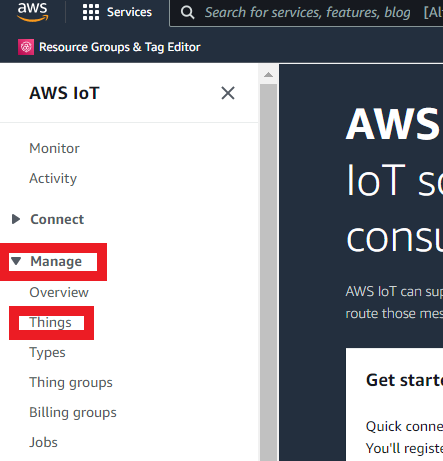

3. Click **Create things.**

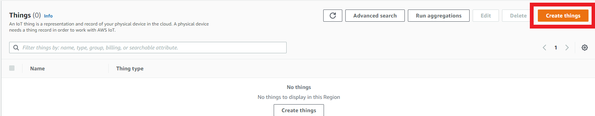

4. Select **Create a single thing** then click **Next**.

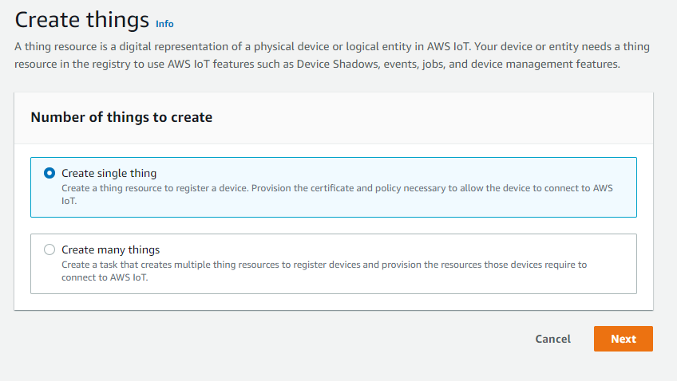

5. Enter a name for your thing, and then click **Next**. For this example, the thing name will be **ExampleThing**.

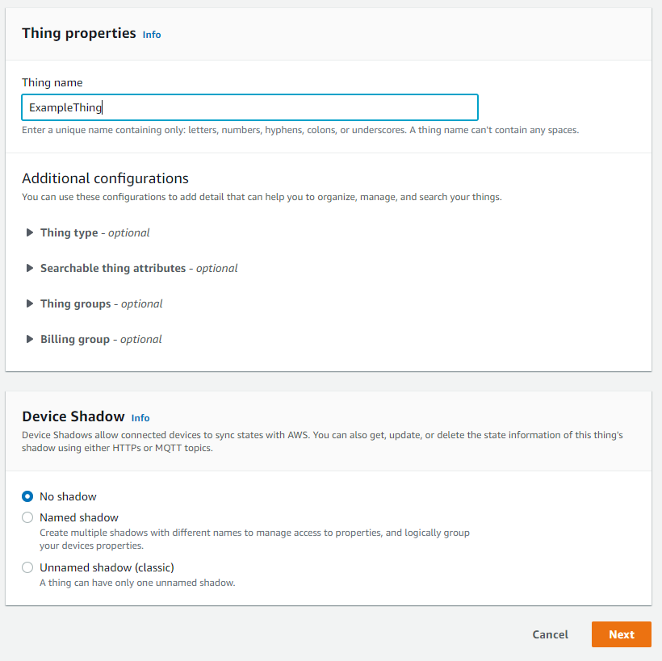

6. Select **Auto-generate a new certificate**, then click **Next**.

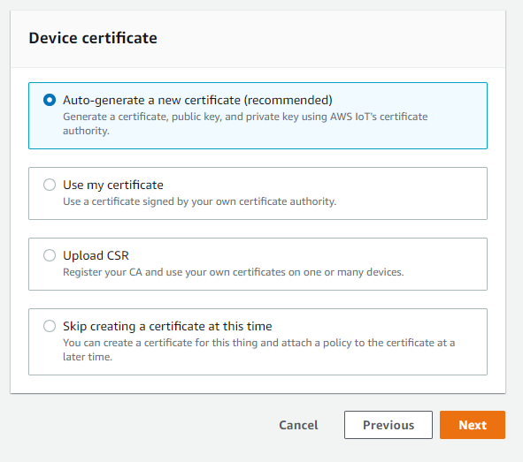

7. Attach the policy you created above by searching for it and clicking the checkbox next to it, then click **Create thing**. **NOTE:** Multiple policies can be attached to a thing.

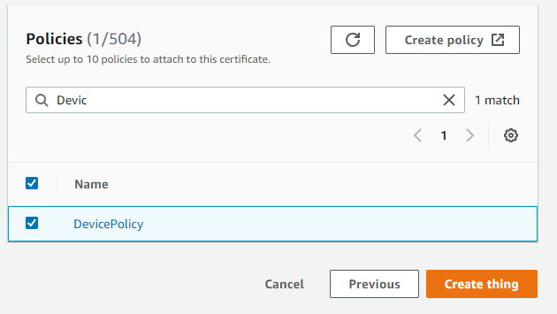

8. Download your **Private Key**, **Public Key**, and **Certificate** by clicking the **Download** links for each. These will be used by your device to connect to AWS IoT Core. **NOTE:** The private key and public key can only be downloaded here, so store them in a safe place.

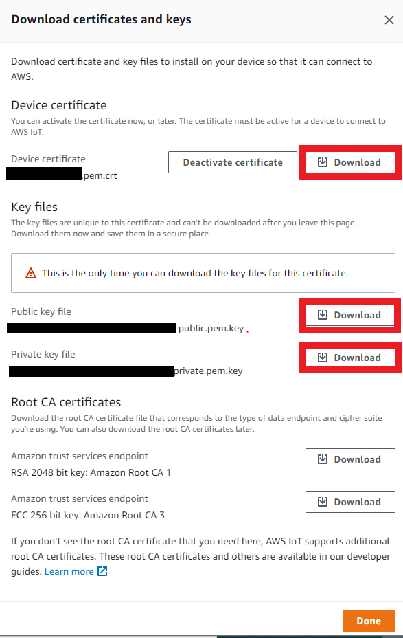

#### Obtaining your AWS endpoint

1. Go to [AWS IoT console](https://console.aws.amazon.com/iotv2/).
2. In the navigation pane, click **Settings**.

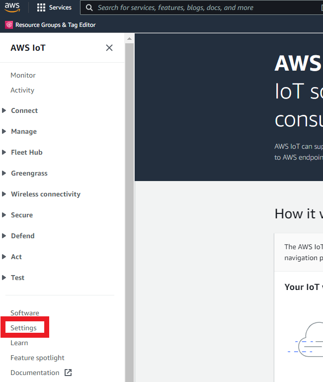

3. Your **AWS endpoint** is under **Device data endpoint**. Note this endpoint as it will be used later when setting up your board.

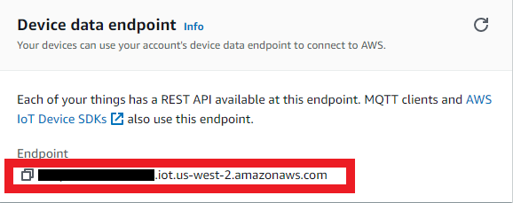
