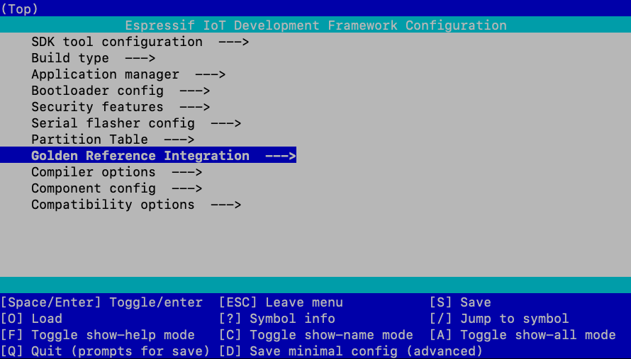

# IoT Reference Integration on ESP32-C3 RISC-V MCU

## Introduction

This repo contains an ESP-IDF project that serves as a reference example for partners looking to develop a well-architected application that is designed to connect to AWS IoT Core and make use of related services in the best possible manner.  

The example shows the use of popular and important [AWS IoT LTS libraries](https://github.com/espressif/esp-aws-iot/tree/master/libraries) by means of a simple example designed to run on the ESP32-C3 which periodically publishes the temperature sensor data to AWS IoT Core and allows the WS2812 LED on the ESP32-C3 DevKit to be controlled using a JSON payload that can be published over MQTT.

This example can be used as a boilerplate to create a production-ready application.

## Features

1. Secure and Simplified provisioning: Provisioning is based on Espressif's [Unified Provisioning API](https://docs.espressif.com/projects/esp-idf/en/latest/esp32c3/api-reference/provisioning/provisioning.html) and can be carried out using Espressif's open source provisioning apps, available on the Google Play Store for Android, and the Apple App Store for iOS and iPadOS.  
[Google Play Store link](https://play.google.com/store/apps/details?id=com.espressif.provble)  
[Apple App Store link](https://apps.apple.com/app/esp-ble-provisioning/id1473590141)  

Both the apps are open source, and the source code for the apps is available on GitHub.  
[Android Provisioning App on GitHub](https://github.com/espressif/esp-idf-provisioning-android)  
[iOS/iPadOS Provisioning App on GitHub](https://github.com/espressif/esp-idf-provisioning-ios)  

2. Libraries used: coreMQTT-Agent, coreJSON and the AWS OTA library.  

3. Sensors and other hardware utilised: Temperature sensor and LED.  

4. Hardware root of trust for secure storage of credentials and certificates.

## Cloning the Repository

Run the following commands to correctly clone the repository:
```
 git clone https://github.com/FreeRTOS/lab-iot-reference-esp32c3.git
 git submodule update --init --recursive
```

## Set up

### Setting up your hardware and development environment

Follow the hardware and development environment setup guides given [here](https://docs.espressif.com/projects/esp-idf/en/latest/esp32c3/get-started/index.html).

### Setting up AWS IoT Core

Follow the [AWS IoT Core Setup Guide](AWSSetup.md).

### Provisioning credentials to device

If you followed the Setting up AWS IoT Core steps, as part of creating a thing, you downloaded a **Private Key** file (`xxx-private.pem.key`) and a **Certificate** file (`xxx-certificate.pem.crt`). You also should have taken note of the device endpoint for your AWS account. These credentials need to be loaded onto the device so it can be identified by AWS IoT Core.

This project provides support for two options for provisioning device credentials required for device identity:  

1. Hardcoding credentials directly into the binary.
2. Using the [Digital Signature Peripheral](https://docs.espressif.com/projects/esp-idf/en/latest/esp32c3/api-reference/peripherals/ds.html).

While use of the [Digital Signature Peripheral](https://docs.espressif.com/projects/esp-idf/en/latest/esp32c3/api-reference/peripherals/ds.html) is the recommended and most secure way for handling device credentials in a production environment, the default developer-friendly workflow is the use of hardcoded certificates.

#### Option 1 - Non-secure method - Hardcoding credentials directly into the binary

1. Open the ESP-IDF menuconfig.
    1. **Terminal/Command Prompt users**
        1. Open the ESP-IDF Terminal/Command Prompt
        2. Set the directory to the root of this project.
        3. Run `idf.py menuconfig`.
    2. **Visual Studio Code users**
        1. Open this project in Visual Studio Code with the Espressif IDF extension.
        2. Click **View** at the top.
        3. Click **Command Palette** in the dropdown menu.
        4. Search for `ESP-IDF: SDK Configuration editor (menuconfig)` and select the command.
        5. The `SDK Configuration editor` window should pop up after a moment.
2. Select `Golden Reference Integration` from the menu.
3. Set `Endpoint for MQTT Broker to use` to your AWS endpoint.
4. Set `Port for MQTT Broker to use` to `8883`.
5. Set `Thing name` to the thing name created for the device.
6. Set `Choose PKI credentials access method` to `Use flash storage (default)`.
7. Copy your **Private Key** file to `main\certs` and rename it to `client.key`.
8. Copy your **Certificate** file to `main\certs` and rename it to `client.crt`.

#### Option 2 - Secure method - Using the [Digital Signature Peripheral](https://docs.espressif.com/projects/esp-idf/en/latest/esp32c3/api-reference/peripherals/ds.html)

1. Open the ESP-IDF menuconfig.
    1. **Terminal/Command Prompt users**
        1. Open the ESP-IDF Terminal/Command Prompt
        2. Set the directory to the root of this project.
        3. Run `idf.py menuconfig`.
    2. **Visual Studio Code users**
        1. Open this project in Visual Studio Code with the Espressif IDF extension.
        2. Click **View** at the top.
        3. Click **Command Palette** in the dropdown menu.
        4. Search for `ESP-IDF: SDK Configuration editor (menuconfig)` and select the command.
        5. The `SDK Configuration editor` window should pop up after a moment.
2. Select `Golden Reference Integration` from the menu.
3. Set `Endpoint for MQTT Broker to use` to your AWS endpoint.
4. Set `Port for MQTT Broker to use` to `8883`.
5. Set `Thing name` to the thing name created for the device.
6. Set `Choose PKI credentials access method` to `Use DS peripheral`.
7. /* TODO */

### Configuring demos

This repository currently supports 3 demos implemented as FreeRTOS tasks, each of which utilize the same MQTT connection managed by the coreMQTT-Agent library for thread-safety. The demos are the following:
* **Over-The-Air update demo:** This demo has the user create an OTA job on AWS IoT for their device and watch as it downloads the updated firmware, and reboot with the updated firmware.
* **SubPubUnsub demo:** This demo creates tasks which Subscribe to a topic on AWS IoT Core, Publish to the same topic, receive their own publish since the device is subscribed to the topic it published to, then Unsubscribe from the topic in a loop.
* **TempPubSub and LED control demo:** This demo utilizes the temperature sensor to send temperature readings to IoT Core, and allows the user to send JSON payloads back to the device to control it's LED.

By default, all 3 demos are enabled and will run concurrently with each other.

To configure the demos:

1. Open the ESP-IDF menuconfig.
    1. **Terminal/Command Prompt users**
        1. Open the ESP-IDF Terminal/Command Prompt
        2. Set the directory to the root of this project.
        3. Run `idf.py menuconfig`.
    2. **Visual Studio Code users**
        1. Open this project in Visual Studio Code with the Espressif IDF extension.
        2. Click **View** at the top.
        3. Click **Command Palette** in the dropdown menu.
        4. Search for `ESP-IDF: SDK Configuration editor (menuconfig)` and select the command.
        5. The `SDK Configuration editor` window should pop up after a moment.
2. Select `Golden Reference Integration` from the menu.

From the `Golden Reference Integration` menu, follow the below guides to configure each demo.

#### Over-The-Air demo configurations

1. Set `Enable OTA demo` to true.
2. With `Enable OTA demo` set to true, an `OTA demo configurations` menu is revealed.
3. From the `OTA demo configurations` menu, the following options can be set:
    * `Max file path size.`: The maximum size of the file paths used in the demo.
    * `Max stream name size.`: The maximum size of the stream name required for downloading update file from streaming service.
    * `OTA statistic output delay milliseconds.`: The delay used in the OTA demo task to periodically output the OTA statistics like number of packets received, dropped, processed and queued per connection.
    * `MQTT operation timeout milliseconds.`: The maximum time for which OTA demo waits for an MQTT operation to be complete. This involves receiving an acknowledgment for broker for SUBSCRIBE, UNSUBSCRIBE and non QOS0 publishes.
    * `OTA agent task stack priority.`: The priority of the OTA agent task that runs within the AWS OTA library.
    * `OTA agent task stack size.`: The task size of the OTA agent task that runs within the AWS OTA library.
    * `Application version major.`: The major number of the application version.
    * `Application version minor.`: The minor number of the application version.
    * `Application version build.`: The build number of the application version.

#### SubPubUnsub demo configurations

/* TODO */

#### TempPubSub and LED control demo configurations

/* TODO */

## Building, flashing, and monitoring the project

### Terminal/Command Prompt users

1. Open an ESP-IDF Terminal/Command Prompt.
2. Set the directory to the root of this project.
3. Run `idf.py -p <PORT> flash monitor` where `<PORT>` is the serial port of the board.

### Visual Studio Code users

1. Open this project in Visual Studio Code with the Espressif IDF extension.
2. Click **View** at the top.
3. Click **Command Palette** in the dropdown menu.
4. Search for `ESP-IDF: Build, Flash and start a monitor on your device` and select the command.

## Interacting with the demos

### Over-The-Air update demo

/* TODO */

### SubPubUnsub demo

/* TODO */

### TempPubSub and LED control demo

/* TODO */
1. Run `idf.py menuconfig` and set the AWS IoT endpoint and Thing Name under `Golden Reference Integration`.



2. This example supports multiple ways to securely store the PKI credentials.
The default method is to use PKI credentials which are embedded in the binary, using the certs from the `certs/` directory. 
3. Run `idf.py build flash monitor -p <UART port>` to build, flash and start the serial console.
4. Subscribe to the `/filter/Publisher0` topic and check if you are getting JSON messages as follows:
```json
{
  "temperatureSensor": {
    "taskName": "Publisher0",
    "temperatureValue": 36.064602,
    "iteration": 1
  }
}
```
5. To change the LED power state, publish the following JSON payload on the same `/filter/Publisher0` topic:
```json
{
    "led":
    {
        "power": 1
    }
}
```

## Security
1. Steps to enable Flash Encryption on ESP32-C3 can be found [here](https://docs.espressif.com/projects/esp-idf/en/latest/esp32c3/security/flash-encryption.html).
2. Steps to enable Secure Boot on ESP32-C3 can be found [here](https://docs.espressif.com/projects/esp-idf/en/latest/esp32c3/security/secure-boot-v2.html).
3. The Digital Signature Peripheral on the ESP32-C3 can operate on encrypted private key directly, restricting software access to device identity.  
The DS Peripheral can be provisioned using the `configure_ds.py` script available in the `components/esp_secure_cert_mgr/tools/` directory and following the steps listed in the `README.md` in the same directory.  
Once you have configured the DS Peripheral and verified it by running the `components/esp_secure_cert_mgr/esp_secure_cert_app` application, simply choose the `Use DS peripheral` option in `idf.py menuconfig`.

```
Golden Reference Integration
└── PKI credentials access method
    └── Use DS peripheral
```

See [CONTRIBUTING](CONTRIBUTING.md#security-issue-notifications) for more information.

## Debugging
Follow the debugging guide of the ESP32-C3 given [here](https://docs.espressif.com/projects/esp-idf/en/latest/esp32c3/api-guides/jtag-debugging/index.html).

## Troubleshooting
* If you are not able to establish USB serial connection, you will need to download the drivers and check the additional information for your operating system in the [Establish Serial Connection](https://docs.espressif.com/projects/esp-idf/en/latest/esp32c3/get-started/establish-serial-connection.html) guide.

* Raise the ESP debug log level to Debug in order to see messages about the connection to AWS, certificate contents, etc.

* Enable mbedTLS debugging (under Components -> mbedTLS -> mbedTLS Debug) in order to see even more low-level debug output from the mbedTLS layer.

* To create a successful AWS IoT connection, the following factors must all be present:
  - Endpoint hostname is correct for your AWS account.
  - Certificate & private key are both attached to correct Thing in AWS IoT Console.
  - Certificate is activated.
  - Policy is attached to the Certificate in AWS IoT Console.
  - Policy contains sufficient permissions to authorize AWS IoT connection.

* If your TLS connection fails entirely

If connecting fails entirely (handshake doesn't complete), this usually indicates a problem with certification configuration. The error usually looks like this:

```
failed! mbedtls_ssl_handshake returned -0x7780
```

(0x7780 is the mbedTLS error code when the server sends an alert message and closes the connection.)

* Check your client private key and certificate file match a Certificate registered and **activated** in AWS IoT console. You can find the Certificate in IoT Console in one of two ways, via the Thing or via Certificates:
  - To find the Certificate directly, click on "Registry" -> "Security Certificates". Then click on the Certificate itself to view it.
  - To find the Certificate via the Thing, click on "Registry" -> "Things", then click on the particular Thing you are using. Click "Certificates" in the sidebar to view all Certificates attached to that Thing. Then click on the Certificate itself to view it.

Verify the Certificate is activated (when viewing the Certificate, it will say "ACTIVE" or "INACTIVE" near the top under the certificate name).

If the Certificate appears correct and activated, verify that you are connecting to the correct AWS IoT endpoint (see above.)

* If your TLS connection closes immediately

Sometimes connecting is successful (the handshake completes) but as soon as the client sends its `MQTT CONNECT` message the server sends back a TLS alert and closes the connection, without anything else happening.

The error returned from AWS IoT is usually -28 (`MQTT_REQUEST_TIMEOUT_ERROR`). You may also see mbedtls error `-0x7780` (server alert), although if this error comes during `mbedtls_ssl_handshake` then it's usually a different problem (see above).

This error implies the Certificate is recognised, but the Certificate is either missing the correct Thing or the correct Policy attached to it.

* Check in the AWS IoT console that your certificate is activated and has both a **security policy** and a **Thing** attached to it. You can find this in IoT Console by clicking "Registry" -> "Security Certificates", then click the Certificate. Once viewing the Certificate, you can click the "Policies" and "Things" links in the sidebar.

## License

Example source code under ./main/ are licensed under the MIT-0 License. See the LICENSE file. For all other source code licenses including components/, see source header documentation.
