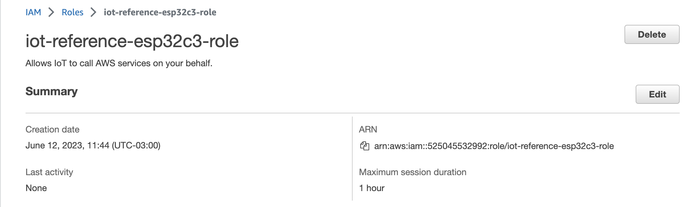
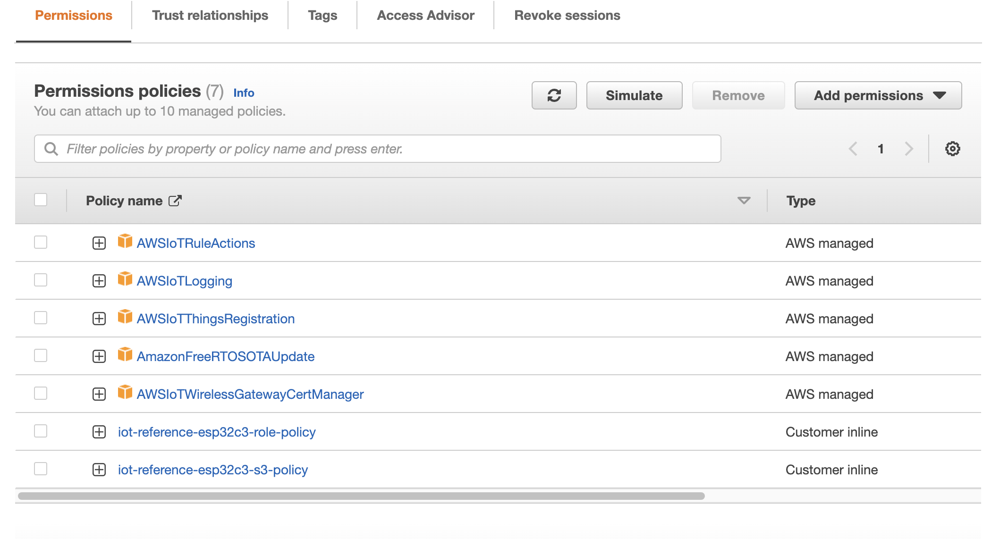

# Known Issues, Workarounds, etc.

Here there are some steps from [Getting Started Guide](GettingStartedGuide.md), that we need it to workaround to make it work.

## Useful Commands
- Find used port by ESP32C3: `ls /dev/tty.*`, e.g.:  /dev/tty.usbserial-1430
  ```
  ls /dev/tty.*
  ```

## Issues

- esptool.py: line 7: import: command not found
  ```bash
  get_idf
  ```
- zsh: command not found: esptool.py
  ```bash
  get_idf
  ```
- Certs not found. [issue](https://github.com/FreeRTOS/iot-reference-esp32c3/issues/37)
  ```bash
  E (687) esp_secure_cert_tlv: Cpuld not find the tlv of type 1
  E (687) esp_secure_cert_tlv: Cpuld not find header for TLV of type 1
  ```
- Enable support for legacy formats in ESP Secure Cert Manager. Run:
  ```bash
  idf.py menuconfig
  ``` 
  Then enable legacy formats, go to: `Component config > ESP Secure Cert Manager -> Enable support for legacy formats`. 
  
- Issues with git submodule. [Read](../Readme.md##cloning-the-repository)
  
# Getting Started Guide

This is not a re-write of the GettingStartedGuide it only aims to make a better experience and avoid extra steps.

## Steps
### 2 Demo setup
### 2.3 Provision the ESP32-C3 with the private key, device certificate and CA certificate in Development Mode

Exports variables
```
export PORT=/dev/tty.usbserial-1440
export CA_CERT_FILEPATH=main/certs/AmazonRootCA1.pem
export DEVICE_CERT_FILEPATH=main/certs/certificate.pem.crt
export PRIVATE_KEY_FILEPATH=main/certs/private.pem.key
```

Run command to provision the private key
```
python managed_components/espressif__esp_secure_cert_mgr/tools/configure_esp_secure_cert.py -p $PORT --keep_ds_data_on_host --ca-cert $CA_CERT_FILEPATH --device-cert $DEVICE_CERT_FILEPATH --private-key $PRIVATE_KEY_FILEPATH --target_chip esp32c3 --secure_cert_type cust_flash
```

### 3 Build and flash the demo project

1. Run the following command to build and flash the demo project:

Exports variables
```
export PORT=/dev/tty.usbserial-1440
export CA_CERT_FILEPATH=main/certs/AmazonRootCA1.pem
export DEVICE_CERT_FILEPATH=main/certs/certificate.pem.crt
export PRIVATE_KEY_FILEPATH=main/certs/private.pem.key
```
```
idf.py -p $PORT flash monitor
```

2. If the ESP32-C3 was previously Wi-Fi provisioned, and you are on a different network and wish to re-provision with new network credentials

```
parttool.py -p $PORT erase_partition --partition-name=nvs
```

### 5 Perform firmware Over-the-Air Updates with AWS IoT
### 5.1 Setup pre-requisites for OTA cloud resources

#### OTA Update Service role

OTA Update Service role should end in something like this:




iot-reference-esp32c3-role-policy
```json
{
    "Version": "2012-10-17",
    "Statement": [
        {
            "Effect": "Allow",
            "Action": [
                "iam:GetRole",
                "iam:PassRole"
            ],
            "Resource": "arn:aws:iam::525045532992:role/iot-reference-esp32c3-role"
        }
    ]
}
```

iot-reference-esp32c3-s3-policy
```json
{
    "Version": "2012-10-17",
    "Statement": [
        {
            "Effect": "Allow",
            "Action": [
                "s3:GetObjectVersion",
                "s3:GetObject",
                "s3:PutObject"
            ],
            "Resource": [
                "arn:aws:s3:::iot-reference-esp32c3-updates/*"
            ]
        }
    ]
}
```